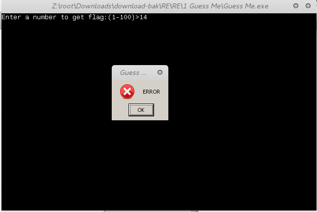
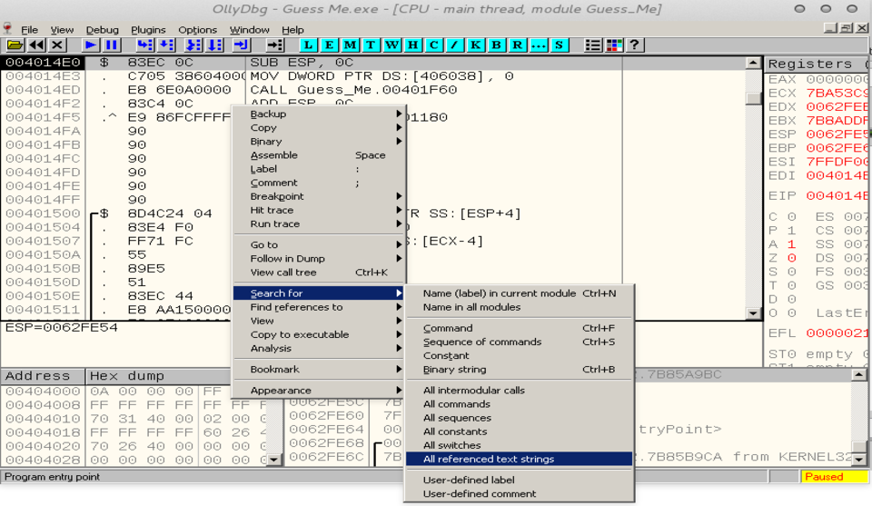
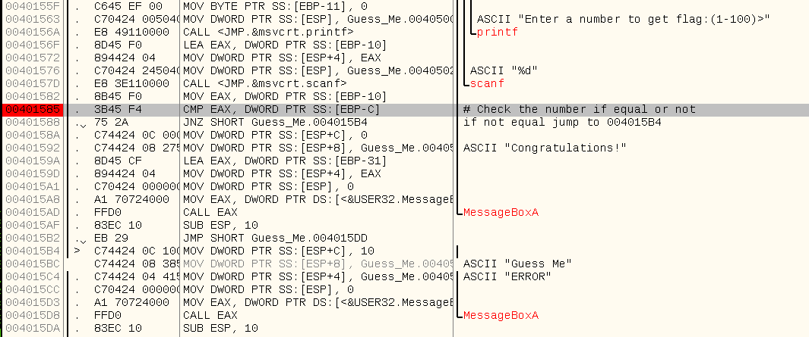
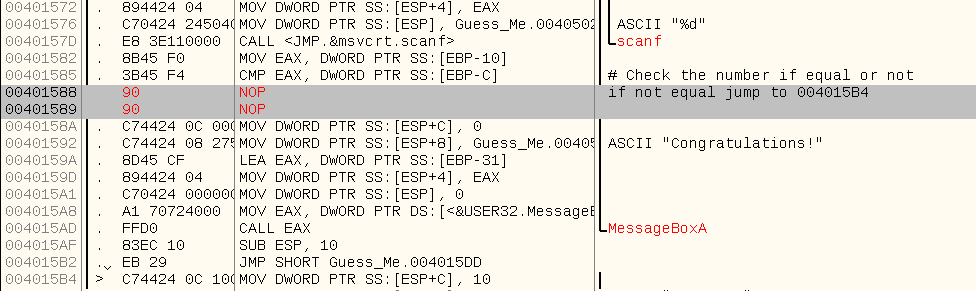
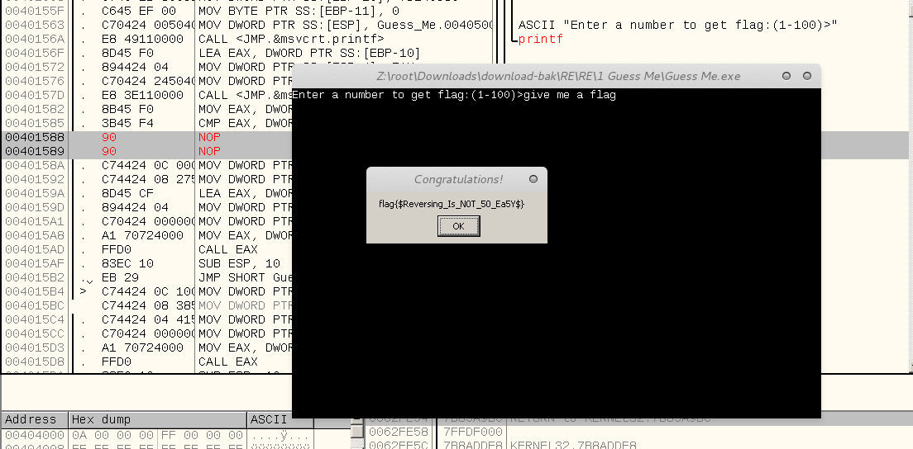

# Guess Me ( 50 )

Guess a number and get the correct flag .

<a href="Guess Me.exe?raw=true">Down the file here</a>

and just open it!
type numbers  So you can see bad boy message box!
  

bad boy message ကို မွတ္ထားပါ။
 
ျပီးေတာ့ olly debuger မွာ ဖြင့္လိုက္ပါ။ 
ျပီးရင္ Search For >> All referenced text strings ကိုေရြးလိုက္ပါ။
 
 

ျပီးေတာ့
bad boy message မွာ right click  နိုပ္ ျပီးေတာ့
 
follow in Disassembler ကိုနိုပ္ ( သို့မဟုတ္ )
 
bad boy message မွာ left click နုိပ္ ျပီးေတာ့
Enter ကိုနိုပ္လိုက္ပါ။

အခုလုိမ်ိုး ျမင္ရပါမယ္ 
 
 

address 00401585 မွာ password ( number ) မွန္ မမွန္ စစ္တယ္
 မမွန္ရင္ 004015B4 address ကို jump သြားလိမ့္မယ္။
ဒါဆိုရင္ 
က်ြန္ေတာ္တို့ က method နွစ္ခုနဲ့ flag ကို ရေအာင္ယူလို့ရတယ္။

1) Serial Fishing 
2) Adding Nop Bytes ( change code )
 
CTF မွာ ဆိုေတာ့ get flag က အဓိကပဲေလ 
 ပထမ နည္းကေတာ့ နည္းနည္းခက္တယ္
 ဒုတိယနည္းကေတာ့ လြယ္တယ္။
ဒုတိယနည္းနဲ့ပဲ လုပ္ျပသြားမယ္  

Virutal address 00401588 မွာ right click တစ္ခ်က္နိုပ္  
ျပီးေတာ့ Binary >> Fill with NOPs ကိုေရြးလိုက္ပါ။
ဒါဆို ေအာက္က လိုမ်ိုးေျပာင္းသြားပါလိမ့္မယ္။

  
 
ျပီးရင္ ေတာ့ F9 နိုပ္ျပီး program ကို run လိုက္ပါ။ 
ျကိုက္တဲ့ numbers ကို နိုပ္ျပီး Enter နိုပ္လိုက္ပါ။  
<a href="flag.txt">Flag </a> ရလာပါလိမ့္မယ္ :D   

  
# easy right?
# Thanks For Reading
# Time : 12:39 AM / 27.12.2016
